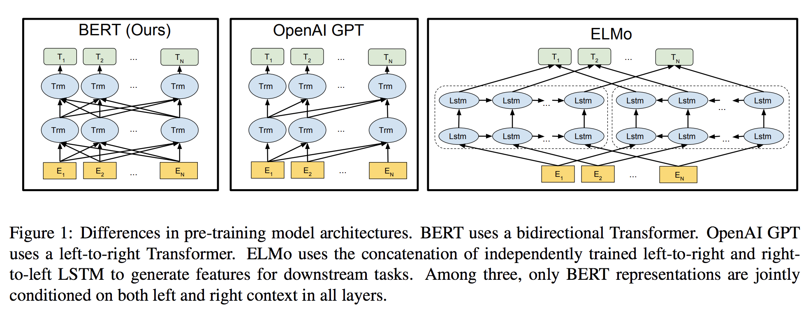
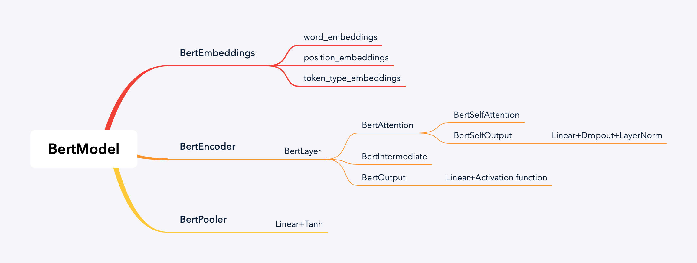
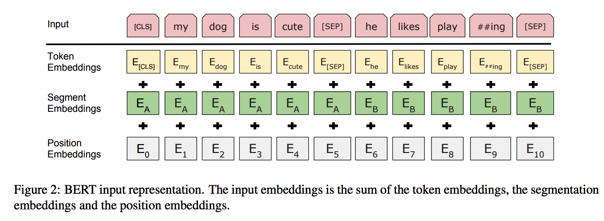
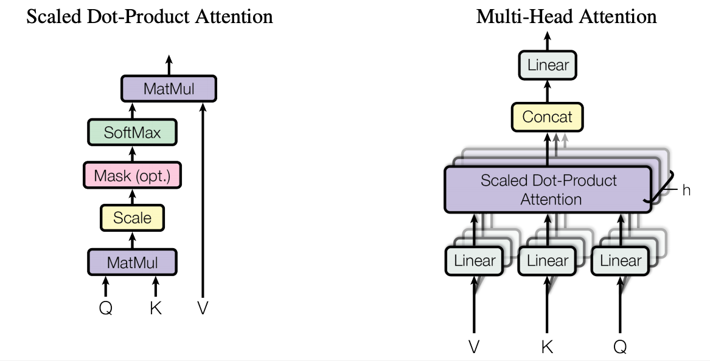
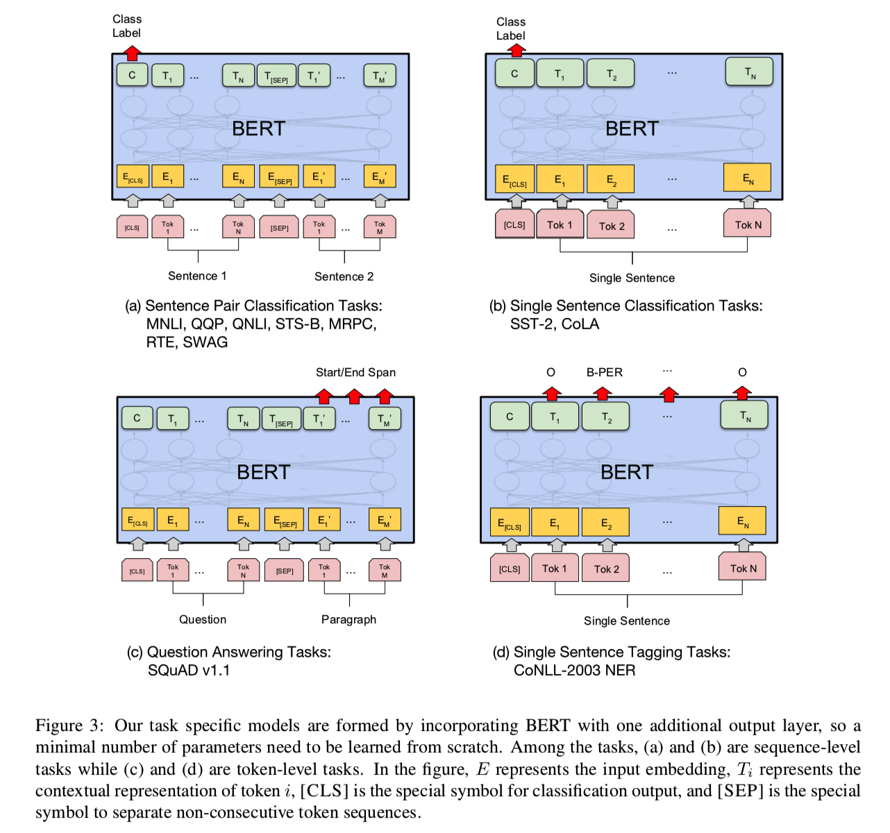

<!--more-->


# 简介

BERT——来自**Transformer的双向编码器表征**。与最近的语言表征模型不同，BERT旨在基于**所有层**的**左、右语境**来预训练深度双向表征。BERT是首个在**大批句子层面**和**token层面**任务中取得当前最优性能的**基于微调的表征模型**，其性能超越许多使用任务特定架构的系统，刷新了11项NLP任务的最优性能记录。

## motivation

作者认为现有的技术严重制约了预训练表征的能力，其主要局限在于语言模型是**单向**的，例如，OpenAI GPT使用的是**从左到右**的架构，其中**每个token只能注意Transformer自注意力层中的先前token**。这些局限对于**句子层面的任务**而言不是最佳选择，对于**token级任务**则可能是毁灭性的，**因为在这种任务中，结合两个方向的语境至关重要**BERT（Bidirectional Encoder Representations from Transformers）改进了**基于微调的策略**。

## solution

BERT提出一种新的**预训练目标**——**遮蔽语言模型（masked language model，MLM）**，来克服上文提到的单向局限。MLM**随机遮蔽输入中的一些token**，通过遮蔽词的语境来**预测其原始词汇id**。与从左到右的语言模型预训练不同，MLM目标**允许表征融合左右两侧的语境**，从而预训练一个深度**双向Transformer**。除了 MLM，还引入了一个**“下一句预测”（next sentence prediction）任务**，该任务**联合预训练**文本对表征。

## contribution

1. Bert模型的**双向特性是最重要的一项新贡献**
2. BERT是首个在大批句子层面和token层面任务中取得当前最优性能的基于微调的表征模型，其性能超越许多使用任务特定架构的系统。证明了**预训练表征**可以**消除对许多精心设计的任务特定架构的需求**。


[论文地址](https://arxiv.org/pdf/1810.04805.pdf)

如果出现公式或者代码乱码问题，移步[github.io](https://jeffery0628.github.io/)

# 模型架构

BERT 旨在基于所有层的左、右语境来预训练深度双向表征。因此，预训练的 BERT 表征可以仅用一个额外的输出层进行微调，进而为很多任务创建当前最优模型，无需对任务特定架构做出大量修改。

## Base & Large

> $BERT_{Base}:L=12,H=768,A=12,Total Parameters=110M$
>
> $BERT_{Large}:L=24,H=1024,A=16,Total Parameters=340M$

其中，$L$:表示层数，$H$:表示隐藏层的size，$A$:表示自注意力head的个数。feed-forward的size为$4H$,即$H=768$时为3072，$H=1024$时为4096。

## BERT & OpenAI GPT & ELMo

$BERT_{Base}$和OpenAI GPT的大小是一样的。BERT Transformer使用**双向自注意力机制**，而GPT Transformer使用受限的自注意力机制，导致每个token只能关注其左侧的语境。双向Transformer在文献中通常称为**“Transformer 编码器”**，而只**关注左侧语境的版本**则因能用于文本生成而被称为**“Transformer 解码器”**。



- BERT 使用双向Transformer
- OpenAI GPT 使用从左到右的Transformer
- ELMo 使用独立训练的从左到右和从右到左LSTM的级联来生成下游任务的特征。

## Pre-training Tasks

### Task1:Masked LM

BERT训练双向语言模型时以较小的概率把少量的词替成了Mask或者另一个随机的词。其目的在于使模型被迫增加对上下文的记忆。标准语言模型只能从左到右或从右到左进行训练，使得每个单词在多层上下文中**间接**地“see itself”。

为了训练一个深度双向表示，研究团队采用了一种简单的方法，即随机屏蔽（masking）部分输入token，然后只预测那些被屏蔽的token。论文将这个过程称为“masked LM”(MLM)。与masked token对应的最终隐藏向量被输入到词汇表上的输出softmax中。

在实验中，随机地Mask每个序列中15%的WordPiece token。

虽然这确实能获得双向预训练模型，但这种方法有两个缺点。

- 缺点1：预训练和finetuning之间不匹配，因为在finetuning期间从未看到`[MASK]`token。

  为了解决这个问题，并不总是用实际的`[MASK]`token替换被“masked”的词汇。使用训练数据生成器**随机选择15％的token**。例如在这个句子“my dog is hairy”中，它选择的token是“hairy”。然后，执行以下过程：
  - 80％的时间：**用`[MASK]`标记替换单词**，例如，`my dog is hairy → my dog is [MASK]`
  - 10％的时间：用一个**随机的单词**替换该单词，例如，`my dog is hairy → my dog is apple`
  - 10％的时间：**保持单词不变**，例如，`my dog is hairy → my dog is hairy`. 这样做的目的是将表示偏向于实际观察到的单词。

  由于Transformer encoder不知道它将被要求预测哪些单词或哪些单词已被随机单词替换，因此它**被迫保持每个输入token的分布式上下文表示**。此外，因为随机替换只发生在所有token的1.5％（即**15％的10％**），这不会损害模型的语言理解能力。

- 缺点2：每个batch只预测了15％的token，这表明模型可能需要更多的预训练步骤才能收敛。

  MLM的收敛速度略慢于 left-to-right的模型（预测每个token），但MLM模型在实验上获得的提升远远超过增加的训练成本。

### Task2:Next Sentence Prediction

为了训练一个**理解句子关系**的模型，预先训练一个二分类的下一句测任务，这一任务可以从任何单语语料库中生成。具体地说，当选择句子A和B作为预训练样本时，B有50％的可能是A的下一个句子，也有50％的可能是来自语料库的随机句子。（实际bert后续的研究中，表明这个任务在理解句子关系表现的不是很理想。）例如：

```
Input = [CLS] the man went to [MASK] store [SEP] he bought a gallon [MASK] milk [SEP]
Label = IsNext

Input = [CLS] the man [MASK] to the store [SEP] penguin [MASK] are flight ##less birds [SEP]
Label = NotNext
```

# 代码实现（pytorch）

参考[transformers](https://github.com/huggingface/transformers)

## 预训练模型

[bert中文预训练模型下载](https://github.com/ymcui/Chinese-BERT-wwm)，解压缩之后，会有三个文件：

```python
bert_config.json # 模型配置文件
pytorch_model.bin # 预训练好的模型
vocab.txt #词汇表
```

vocab.txt是模型的词典，这个文件会经常要用到。*bert_config.json*是BERT的配置(超参数)，比如网络的层数，通常不需要修改，如果自己显存小的话，也可以调小一下bert的层数。pytorch_model是预训练好的模型的模型参数，Fine-Tuning模型的初始值就是来自这个文件，然后根据不同的任务进行Fine-Tuning。

```json bert_config.json
{
  "attention_probs_dropout_prob": 0.1,  #乘法attention时，softmax后dropout概率 
  "directionality": "bidi", 
  "hidden_act": "gelu",  #激活函数 
  "hidden_dropout_prob": 0.1,  #隐藏层dropout概率 
  "hidden_size": 768,  #隐藏单元数 (embedding_size)
  "initializer_range": 0.02,   #初始化范围 
  "intermediate_size": 3072,  #升维维度
  "max_position_embeddings": 512,  #用于生成position_embedding。输入序列长度（seq_len）不能超过512
  "num_attention_heads": 12,  #每个隐藏层中的attention head数 (则，每个head的embedding_size=768/12=64)
  "num_hidden_layers": 12, #隐藏层数 
  "pooler_fc_size": 768, 
  "pooler_num_attention_heads": 12, 
  "pooler_num_fc_layers": 3, 
  "pooler_size_per_head": 128, 
  "pooler_type": "first_token_transform", 
  "type_vocab_size": 2,  #segment_ids类别 [0,1] 
  "vocab_size": 21128 #词典中词数
}
```
vocab.txt中的部分内容
```txt vocab.txt
馬
高
龍
龸
fi
fl
！
（
）
，
－
．
／
：
？
～
the
of
and
in
to
```

## Data

### step 1: read example from file

```python read_examples_from_file
@dataclass
class InputExample:
    """
    A single training/test example for token classification.
	用于保存当个样本实例。
    Args:
        guid: 样本id.
        words: 文本序列，list类型：[word1,word2,...wordn]. 
        labels: 序列对应的label， This should be specified for train and dev examples, but not for test examples.
    """
	
    # 由于语法糖@dataclass,会自动对该类添加__init__()函数。
    guid: str
    words: List[str]
    labels: Optional[List[str]]
        
def read_examples_from_file(data_dir, mode: Union[Split, str]) -> List[InputExample]:
    """
    data_dir: 原始数据所在的文件夹
    model：‘train’(‘valid’)对应的数据会有label，‘test’数据的label为0
    return：
    	examples：list类型，包含train or valid or test 中的所有样本。
    """
    if isinstance(mode, Split):
        mode = mode.value
    file_path = os.path.join(data_dir, f"{mode}.txt")
    guid_index = 1
    examples = []
    with open(file_path, encoding="utf-8") as f:
        words = []
        labels = []
        for line in f:
            if line.startswith("-DOCSTART-") or line == "" or line == "\n":
                if words:
                    examples.append(InputExample(guid=f"{mode}-{guid_index}", words=words, labels=labels))
                    guid_index += 1
                    words = []
                    labels = []
            else:
                splits = line.split(" ")
                words.append(splits[0])
                if len(splits) > 1:
                    labels.append(splits[-1].replace("\n", ""))
                else:
                    # Examples could have no label for mode = "test"
                    labels.append("O")
        if words:
            examples.append(InputExample(guid=f"{mode}-{guid_index}", words=words, labels=labels))
    return examples
```

### step 2:convert example into feature

#### BasicTokenizer

在转化成feature之前需要先了解一下bert的分词：

1. 对于文本序列中不想被切分开的词可以放到一个列表中，通过never_split传入分词函数中，就不会对列表中的文字进行分词。
2. 中文序列标注任务需要注意：`'\t', '\n', '\r'，' '`会被替换成空白字符`' '`添加到文本中，英文文本对文本进行分词的时候又会根据空白字符来进行分词，导致空白字符会被直接清洗掉，这样就会导致中文序列标注的标签中的`'\t', '\n', '\r'，' '`在分词之后找不到对应的位置。

```python BasicTokenizer
class BasicTokenizer(object):
    """Runs basic tokenization (punctuation splitting, lower casing, etc.)."""
    def __init__(self, do_lower_case=True, never_split=None, tokenize_chinese_chars=True):
        """ Constructs a BasicTokenizer.
        Args:
            **do_lower_case**: Whether to lower case the input.
            **never_split**: (`optional`) List of token not to split.
            **tokenize_chinese_chars**: (`optional`),是否对中文分词，默认是true
        """
        if never_split is None:
            never_split = []
        self.do_lower_case = do_lower_case
        self.never_split = never_split
        self.tokenize_chinese_chars = tokenize_chinese_chars

    def tokenize(self, text, never_split=None):
        """ Basic Tokenization of a piece of text.
            仅仅根据 空白字符 来进行分词
        Args:
            **never_split**: (`optional`)，对哪些文字不进行分词，[person,people,..],如果正常分词的话，person 会被切成per ##son，但是person如果被放入这个列表中，就不会被切分开
        """
        never_split = self.never_split + (never_split if never_split is not None else [])
        
        # 注意： 非法中文字符会被从文本中删除，以及‘\t’, ‘\n’, and ‘\r’，‘ ’会被替换成空白字符‘ ’添加到文本中，对文本进行分词的时候又会根据空白字符来进行分词，导致空白字符会被直接清洗掉，对于序列标注任务来说，会造成文本与标签对不齐的问题。
        text = self._clean_text(text)
        if self.tokenize_chinese_chars:
            # 对中文字符按 字 进行分词，对中文分词过滤一遍之后在对英文字符进行分词。
            text = self._tokenize_chinese_chars(text)
            
        orig_tokens = whitespace_tokenize(text) # 先按照空白字符进行分词。
        split_tokens = []
        for token in orig_tokens:
            if self.do_lower_case and token not in never_split:
                token = token.lower()
                token = self._run_strip_accents(token)
            split_tokens.extend(self._run_split_on_punc(token, never_split))
        output_tokens = whitespace_tokenize(" ".join(split_tokens))
        return output_tokens

    def _run_strip_accents(self, text):
        """Strips accents from a piece of text."""
        text = unicodedata.normalize("NFD", text)
        output = []
        for char in text:
            cat = unicodedata.category(char)
            if cat == "Mn":
                continue
            output.append(char)
        return "".join(output)

    def _run_split_on_punc(self, text, never_split=None):
        """Splits punctuation on a piece of text."""
        if never_split is not None and text in never_split:
            return [text]
        chars = list(text)
        i = 0
        start_new_word = True
        output = []
        while i < len(chars):
            char = chars[i]
            if _is_punctuation(char):
                output.append([char])
                start_new_word = True
            else:
                if start_new_word:
                    output.append([])
                start_new_word = False
                output[-1].append(char)
            i += 1

        return ["".join(x) for x in output]

    def _tokenize_chinese_chars(self, text):
        """对中文合法字符按字进行分割。"""
        output = []
        for char in text:
            cp = ord(char)
            if self._is_chinese_char(cp):
                output.append(" ")
                output.append(char)
                output.append(" ")
            else:
                output.append(char)
        return "".join(output)

    def _is_chinese_char(self, cp):
        """判断cp是否是中文合法字符
        0x4e00-0x9fff cjk 统一字型 常用字 共 20992个（实际只定义到0x9fc3)
        0x3400-0x4dff cjk 统一字型扩展表a 少用字 共 6656个
        0x20000-0x2a6df cjk 统一字型扩展表b 少用字，历史上使用 共42720个
        0xf900-0xfaff cjk 兼容字型 重复字，可统一变体，共同字 共512个
        0x2f800-0x2fa1f cjk 兼容字型补遗 可统一变体 共544个
        """
        if (
            (cp >= 0x4E00 and cp <= 0x9FFF)
            or (cp >= 0x3400 and cp <= 0x4DBF)  #
            or (cp >= 0x20000 and cp <= 0x2A6DF)  #
            or (cp >= 0x2A700 and cp <= 0x2B73F)  #
            or (cp >= 0x2B740 and cp <= 0x2B81F)  #
            or (cp >= 0x2B820 and cp <= 0x2CEAF)  #
            or (cp >= 0xF900 and cp <= 0xFAFF)
            or (cp >= 0x2F800 and cp <= 0x2FA1F)  #
        ):  #
            return True

        return False

    def _clean_text(self, text):
        """过滤掉非法字符，把`'\t', '\n', '\r'，' '`会被替换成空白字符`' '`"""
        output = []
        for char in text:
            cp = ord(char)
            if cp == 0 or cp == 0xFFFD or _is_control(char):
                continue
            if _is_whitespace(char):
                output.append(" ")
            else:
                output.append(char)
        return "".join(output)
```
#### WordpieceTokenizer

经过`BasicTokenizer`处理成空格隔开的单词之后，还需要在经过WordpieceTokenizer对英文单词进行更细粒度的切分：

> input = "unaffable"
>
> output = ["un", "##aff", "##able"]

```python
class WordpieceTokenizer(object):
    """Runs WordPiece tokenization."""

    def __init__(self, vocab, unk_token, max_input_chars_per_word=100):
        self.vocab = vocab
        self.unk_token = unk_token
        self.max_input_chars_per_word = max_input_chars_per_word

    def tokenize(self, text):
        """
        For example:input = "unaffable"output = ["un", "##aff", "##able"]

        Args:
          text: 经过`BasicTokenizer`分词之后，
        Returns:
          A list of wordpiece tokens.
        """

        output_tokens = []
        for token in whitespace_tokenize(text):
            chars = list(token)
            if len(chars) > self.max_input_chars_per_word:
                output_tokens.append(self.unk_token)
                continue

            is_bad = False
            start = 0
            sub_tokens = []
            while start < len(chars):
                end = len(chars)
                cur_substr = None
                while start < end:
                    substr = "".join(chars[start:end])
                    if start > 0:
                        substr = "##" + substr
                    if substr in self.vocab: # 如果在词汇表中存在该wordpiece
                        cur_substr = substr
                        break
                    end -= 1
                if cur_substr is None:
                    is_bad = True
                    break
                sub_tokens.append(cur_substr)
                start = end

            if is_bad:
                output_tokens.append(self.unk_token)
            else:
                output_tokens.extend(sub_tokens)
        return output_tokens
```

#### BertTokenizer

`BertTokenizer`基于`WordPiece`，需要注意的地方是，对于中文文本来说，中文文本是没有空格分隔的文本，所以是需要在WordPiece之前do_basic_tokenize，也就是对于中文来说，需要`do_basic_tokenize=True`,不然对于没有分隔的中文字符会由于其长度超过词的最大长度，被修改为`[UNK]`

```python
class BertTokenizer(PreTrainedTokenizer):
    r"""
    Constructs a BERT tokenizer. Based on WordPiece.
    这是一个替换原文本中符号，检测元文本中的单词是否在预训练字典中，将单词替换成字典中对应的id，对文本的长度进行padding的一个类。
    Args:
        vocab_file:词汇表文件
        do_lower_case:是否大写变小写，默认True
        do_basic_tokenize:是否在WordPiece之前做basci tokenize,对于中文字符来说
        never_split：哪些词不需要在进行更细粒度的切分，前提需要`do_basic_tokenize=True`，才会起作用。
        unk_token：对于不在词汇表中的词汇被修改成unk_token，默认是 "[UNK]"，无特殊需要，使用默认就好。
        sep_token：分隔句子的标识，默认是"[SEP]"，无特殊需要，使用默认就好。
        pad_token:超出句子长度的内容被填补pad_token, 默认是"[PAD]"，无特殊需要，使用默认就好。
        cls_token：句子分类，默认"[CLS]"，原用于NSP任务，可用该字符对应的输出向量做文本分类任务
        mask_token：对文本进行mask的字符，用于MAKS LM 任务，被mask住的字符需要在训练阶段进行predict，默认是"[MASK]"，无特殊需要，使用默认就好。
        tokenize_chinese_chars：是否对中文字符进行分词。
    """

    vocab_files_names = VOCAB_FILES_NAMES # 词汇表文件名
    pretrained_vocab_files_map = PRETRAINED_VOCAB_FILES_MAP
    pretrained_init_configuration = PRETRAINED_INIT_CONFIGURATION
    max_model_input_sizes = PRETRAINED_POSITIONAL_EMBEDDINGS_SIZES

    def __init__(
        self,
        vocab_file,
        do_lower_case=True,
        do_basic_tokenize=True,
        never_split=None,
        unk_token="[UNK]",
        sep_token="[SEP]",
        pad_token="[PAD]",
        cls_token="[CLS]",
        mask_token="[MASK]",
        tokenize_chinese_chars=True,
        **kwargs
    ):
        super().__init__(
            unk_token=unk_token,
            sep_token=sep_token,
            pad_token=pad_token,
            cls_token=cls_token,
            mask_token=mask_token,
            **kwargs,
        )
        self.max_len_single_sentence = self.max_len - 2  # take into account special tokens
        self.max_len_sentences_pair = self.max_len - 3  # roberta，take into account special tokens

        if not os.path.isfile(vocab_file):
            raise ValueError(
                "Can't find a vocabulary file at path '{}'. To load the vocabulary from a Google pretrained "
                "model use `tokenizer = BertTokenizer.from_pretrained(PRETRAINED_MODEL_NAME)`".format(vocab_file)
            )
        # 加载词汇表文件
        self.vocab = load_vocab(vocab_file)
        # id 到 token 的映射
        self.ids_to_tokens = collections.OrderedDict([(ids, tok) for tok, ids in self.vocab.items()])
        self.do_basic_tokenize = do_basic_tokenize
        if do_basic_tokenize:
            self.basic_tokenizer = BasicTokenizer(
                do_lower_case=do_lower_case, never_split=never_split, tokenize_chinese_chars=tokenize_chinese_chars
            )
        self.wordpiece_tokenizer = WordpieceTokenizer(vocab=self.vocab, unk_token=self.unk_token)

    @property
    def vocab_size(self):
        return len(self.vocab)

    def get_vocab(self):
        return dict(self.vocab, **self.added_tokens_encoder)

    def _tokenize(self, text):
        split_tokens = []
        if self.do_basic_tokenize:
            for token in self.basic_tokenizer.tokenize(text, never_split=self.all_special_tokens):
                for sub_token in self.wordpiece_tokenizer.tokenize(token):
                    split_tokens.append(sub_token)
        else:
            split_tokens = self.wordpiece_tokenizer.tokenize(text)
        return split_tokens

    def _convert_token_to_id(self, token):
        """ 把词映射到id"""
        return self.vocab.get(token, self.vocab.get(self.unk_token))

    def _convert_id_to_token(self, index):
        """把token id 映射成词"""
        return self.ids_to_tokens.get(index, self.unk_token)

    def convert_tokens_to_string(self, tokens):
        """ 英文：把wordpiece之后的tokens 还原成文本。没有处理中文的换行等"""
        out_string = " ".join(tokens).replace(" ##", "").strip()
        return out_string

    def build_inputs_with_special_tokens(
        self, token_ids_0: List[int], token_ids_1: Optional[List[int]] = None
    ) -> List[int]:
        """为分词后的句子添加special token：[CLS]、[SEP]
        - single sequence: ``[CLS] X [SEP]``
        - pair of sequences: ``[CLS] A [SEP] B [SEP]``
        """
        if token_ids_1 is None:
            return [self.cls_token_id] + token_ids_0 + [self.sep_token_id]
        cls = [self.cls_token_id]
        sep = [self.sep_token_id]
        return cls + token_ids_0 + sep + token_ids_1 + sep

    def get_special_tokens_mask(
        self, token_ids_0: List[int], token_ids_1: Optional[List[int]] = None, already_has_special_tokens: bool = False
    ) -> List[int]:
        """判断token_ids 是否已经添加过special token，用mask序列来表示：[0,1,1,1,1,0],0表示special token，返回mask 序列
        """
        if already_has_special_tokens:
            if token_ids_1 is not None:
                raise ValueError(
                    "You should not supply a second sequence if the provided sequence of "
                    "ids is already formated with special tokens for the model."
                )
            return list(map(lambda x: 1 if x in [self.sep_token_id, self.cls_token_id] else 0, token_ids_0))

        if token_ids_1 is not None:
            return [1] + ([0] * len(token_ids_0)) + [1] + ([0] * len(token_ids_1)) + [1]
        return [1] + ([0] * len(token_ids_0)) + [1]

    def create_token_type_ids_from_sequences(
        self, token_ids_0: List[int], token_ids_1: Optional[List[int]] = None
    ) -> List[int]:
        """根据序列创建 token type ids，用于表示句子分割，如果只有一个句子，返回全为0的列表，如果是两个句子，则表示成如下：
            0 0 0 0 0 0 0 0 0 0 0 1 1 1 1 1 1 1 1 1
            | first sequence    | second sequence |
        """
        sep = [self.sep_token_id]
        cls = [self.cls_token_id]
        if token_ids_1 is None:
            return len(cls + token_ids_0 + sep) * [0]
        return len(cls + token_ids_0 + sep) * [0] + len(token_ids_1 + sep) * [1]

    def save_vocabulary(self, vocab_path):
        """
        Save the sentencepiece vocabulary (copy original file) and special tokens file to a directory.
        """
        index = 0
        if os.path.isdir(vocab_path):
            vocab_file = os.path.join(vocab_path, VOCAB_FILES_NAMES["vocab_file"])
        else:
            vocab_file = vocab_path
        with open(vocab_file, "w", encoding="utf-8") as writer:
            for token, token_index in sorted(self.vocab.items(), key=lambda kv: kv[1]):
                if index != token_index:
                    logger.warning(
                        "Saving vocabulary to {}: vocabulary indices are not consecutive."
                        " Please check that the vocabulary is not corrupted!".format(vocab_file)
                    )
                    index = token_index
                writer.write(token + "\n")
                index += 1
        return (vocab_file,)
```

由于BertTokenizer继承了PreTrainedTokenizer，对PreTrainedTokenizer感兴趣可以通过这个[链接](https://github.com/huggingface/transformers/blob/ef46ccb05c601f413a774d43524591816406778d/src/transformers/tokenization_utils.py#L693)在进行研究。

#### Input feature

```python convert_example_to_features
@dataclass
class InputFeatures:
    """
    InputExample 对应的 feature，该类变量名称与model中的变量是对应的。
    @dataclass 自动为该类添加初始化函数__init__().
    """
    input_ids: List[int] # 输入样本的id
    attention_mask: List[int] # 
    # 用来指示第几个句子，比如：
    # tokens:   [CLS] is this jack ##son ##ville ? [SEP] no it is not . [SEP]
    #  type_ids:   0   0  0    0    0     0       0   0   1  1  1  1   1   1
    token_type_ids: Optional[List[int]] = None 

    # 由于是序列标注任务，所以label对应的也应该是一个序列。
    label_ids: Optional[List[int]] = None 
        
        
# 实际上该函数没有处理中文分词中，换行（\n）,空格字符对齐的问题。    
def convert_examples_to_features(
    examples: List[InputExample], # 样本集
    label_list: List[str], # 样本集对应的标签集
    max_seq_length: int, # 最大序列长度，但是不应该超过510（512应该包含[CLS],[SEP]两个字符）
    tokenizer: PreTrainedTokenizer, # 分词器
    cls_token_at_end=False, # [CLS]字符是否添加在序列最后，默认是放在序列最前面，False：[CLS] + A + [SEP] + B + [SEP]，True: A + [SEP] + B + [SEP] + [CLS]
    cls_token="[CLS]",
    cls_token_segment_id=1, # ？？ `cls_token_segment_id` define the segment id associated to the CLS token (0 for BERT, 2 for XLNet)
    sep_token="[SEP]",
    sep_token_extra=False, # roberta 中会有extra sep token
    pad_on_left=False, # 是否在序列的左边进行pad
    pad_token=0,
    pad_token_segment_id=0, # padding token_ids 的值为0
    pad_token_label_id=-100, # 序列标注的tag，超出序列长度的部分，pad成：-100
    sequence_a_segment_id=0, # 第一句对应的seg id：0  --> type_ids:   0   0  0    0    0     0       0   0   1  1  1  1   1   1
    mask_padding_with_zero=True, # 对padding的部分，mask对应的值为0
) -> List[InputFeatures]:
        
	# label 到 index 的映射 ： [B,M,E,S]-->[0,1,2,3]
	label_map = {label: i for i, label in enumerate(label_list)} 
	
	features = []
	for (ex_index, example) in enumerate(examples):
	    if ex_index % 10_000 == 0:
	        logger.info("Writing example %d of %d", ex_index, len(examples))
	
	    tokens = []  # 文本序列分词之后的列表:sentence --> [word1,wor2,word3,....]
	    label_ids = [] # 由于分词之后，label 和 tokens 会产生错位现象（[CLS],[SEP],空格,换行等字符导致的问题），需要重新和分词之后的内容对齐。
	    for word, label in zip(example.words, example.labels):
	        word_tokens = tokenizer.tokenize(word)
	
	        if len(word_tokens) > 0:
	            tokens.extend(word_tokens)
	            label_ids.extend([label_map[label]] + [pad_token_label_id] * (len(word_tokens) - 1))
	
	    # Account for [CLS] and [SEP] with "- 2" and with "- 3" for RoBERTa.
	    special_tokens_count = tokenizer.num_special_tokens_to_add()
	    # 先取出不添加special token的序列，再在这个序列的基础上，添加special token
	    if len(tokens) > max_seq_length - special_tokens_count:
	        tokens = tokens[: (max_seq_length - special_tokens_count)]
	        label_ids = label_ids[: (max_seq_length - special_tokens_count)]
	
	    # 在序列末尾添加[SEP]
	    tokens += [sep_token]
	    label_ids += [pad_token_label_id]
	    
	    # roberta 的extra token
	    if sep_token_extra:
	        # roberta uses an extra separator b/w pairs of sentences
	        tokens += [sep_token]
	        label_ids += [pad_token_label_id]
	        
	    # 第一句对应的seg id：0  --> type_ids: 0 0 0 0 0 0 0 0 1 1 1 1 1 1
	    segment_ids = [sequence_a_segment_id] * len(tokens)
		
	    # [CLS] 添加到句首还是句末
	    if cls_token_at_end:
	        tokens += [cls_token]
	        label_ids += [pad_token_label_id]
	        segment_ids += [cls_token_segment_id]
	    else:
	        tokens = [cls_token] + tokens
	        label_ids = [pad_token_label_id] + label_ids
	        segment_ids = [cls_token_segment_id] + segment_ids
		
	    # 把词转化成token id
	    input_ids = tokenizer.convert_tokens_to_ids(tokens)
	
	    # The mask has 1 for real tokens and 0 for padding tokens. Only real tokens are attended to.
	    input_mask = [1 if mask_padding_with_zero else 0] * len(input_ids)
	
	    # 添加0padding到句子最大长度
	    padding_length = max_seq_length - len(input_ids)
	    # 在句子的左边padding 0 还是在句子的右边padding 0
	    if pad_on_left:
	        input_ids = ([pad_token] * padding_length) + input_ids
	        input_mask = ([0 if mask_padding_with_zero else 1] * padding_length) + input_mask
	        segment_ids = ([pad_token_segment_id] * padding_length) + segment_ids
	        label_ids = ([pad_token_label_id] * padding_length) + label_ids
	    else:
	        input_ids += [pad_token] * padding_length
	        input_mask += [0 if mask_padding_with_zero else 1] * padding_length
	        segment_ids += [pad_token_segment_id] * padding_length
	        label_ids += [pad_token_label_id] * padding_length
	
	    assert len(input_ids) == max_seq_length
	    assert len(input_mask) == max_seq_length
	    assert len(segment_ids) == max_seq_length
	    assert len(label_ids) == max_seq_length
	
	    if ex_index < 5:
	        logger.info("*** Example ***")
	        logger.info("guid: %s", example.guid)
	        logger.info("tokens: %s", " ".join([str(x) for x in tokens]))
	        logger.info("input_ids: %s", " ".join([str(x) for x in input_ids]))
	        logger.info("input_mask: %s", " ".join([str(x) for x in input_mask]))
	        logger.info("segment_ids: %s", " ".join([str(x) for x in segment_ids]))
	        logger.info("label_ids: %s", " ".join([str(x) for x in label_ids]))
	
	    if "token_type_ids" not in tokenizer.model_input_names:
	        segment_ids = None
	
	    features.append(
	        InputFeatures(
	            input_ids=input_ids, attention_mask=input_mask, token_type_ids=segment_ids, label_ids=label_ids
	        )
	    )
	return features
```

### step 3:Dataset

有了样本和特征，构建数据集类。

```python
class NerDataset(Dataset):
    features: List[InputFeatures]
    # 对于pad的部分不计算损失 
    pad_token_label_id: int = nn.CrossEntropyLoss().ignore_index
    def __init__(
        self,
        data_dir: str,
        tokenizer: PreTrainedTokenizer,
        labels: List[str],
        model_type: str,
        max_seq_length: Optional[int] = None,
        overwrite_cache=False,
        mode: Split = Split.train,
        local_rank=-1,
        ):
        # 加载数据集文件
        cached_features_file = os.path.join(data_dir, "cached_{}_{}_{}".format(mode.value, tokenizer.__class__.__name__, str(max_seq_length)), )
        with torch_distributed_zero_first(local_rank):
        # Make sure only the first process in distributed training processes the dataset,
        # and the others will use the cache.
            if os.path.exists(cached_features_file) and not overwrite_cache:
                logger.info(f"Loading features from cached file {cached_features_file}")
                self.features = torch.load(cached_features_file)
            else:
                logger.info(f"Creating features from dataset file at {data_dir}")
                examples = read_examples_from_file(data_dir, mode)
                # TODO clean up all this to leverage built-in features of tokenizers
                self.features = convert_examples_to_features(
                    examples,
                    labels,
                    max_seq_length,
                    tokenizer,
                    cls_token_at_end=bool(model_type in ["xlnet"]),
                    # xlnet has a cls token at the end
                    cls_token=tokenizer.cls_token,
                    cls_token_segment_id=2 if model_type in ["xlnet"] else 0,
                    sep_token=tokenizer.sep_token,
                    sep_token_extra=bool(model_type in ["roberta"]),
                    # roberta uses an extra separator b/w pairs of sentences, cf. github.com/pytorch/fairseq/commit/1684e166e3da03f5b600dbb7855cb98ddfcd0805
                    pad_on_left=bool(tokenizer.padding_side == "left"),
                    pad_token=tokenizer.pad_token_id,
                    pad_token_segment_id=tokenizer.pad_token_type_id,
                    pad_token_label_id=self.pad_token_label_id,
                )
                # 保存0卡上的数据到缓存
                if local_rank in [-1, 0]:
                    logger.info(f"Saving features into cached file {cached_features_file}")
                    torch.save(self.features, cached_features_file)
    def __len__(self):
        return len(self.features)
    def __getitem__(self, i) -> InputFeatures:
        return self.features[i]
```

## BertModel



从整体来看BertModel由三部分组成：BertEmbeddings、BertEncoder、BertPooler,需要注意`attention_mask和head_mask`的处理。

forward：(符号'是可以为None的意思)

- 接收参数：`inputs，segment，mask'，position_ids'，head_mask'`

- 输出：`元组 (最后一层的隐变量，最后一层第一个token的隐变量，最后一层的隐变量或每一层attentions 权重参数)`

- 过程:`embedding->encoder->pooler`


```python
class BertModel(BertPreTrainedModel):

    def __init__(self, config):
        super().__init__(config)
        self.config = config

        self.embeddings = BertEmbeddings(config)
        self.encoder = BertEncoder(config)
        self.pooler = BertPooler(config)

        self.init_weights()

    def get_input_embeddings(self):
        return self.embeddings.word_embeddings

    def set_input_embeddings(self, value):
        self.embeddings.word_embeddings = value

    def _prune_heads(self, heads_to_prune):
        """ E.g. {1: [0, 2], 2: [2, 3]} will prune heads 0 and 2 on layer 1 and heads 2 and 3 on layer 2.
        """
        for layer, heads in heads_to_prune.items():
            self.encoder.layer[layer].attention.prune_heads(heads)

    @add_start_docstrings_to_callable(BERT_INPUTS_DOCSTRING)
    def forward(self,input_ids=None,attention_mask=None,token_type_ids=None,position_ids=None,
        head_mask=None,inputs_embeds=None,encoder_hidden_states=None,encoder_attention_mask=None,):
        """
        参数：
        head_mask: head_mask has shape [num_heads] or [num_hidden_layers x num_heads]
        encoder_hidden_states:??
        encoder_attention_mask:??
        返回值：
        last_hidden_state :[batch_size, sequence_length, hidden_size]，是序列在模型最后一层的输出的隐藏层
        pooler_output :[batch_size, hidden_size]:[CLS]对应的隐状态的输出，由于这个token是用来做NSP任务的，这个输出通常不能很好的summary 整个序列的语义，如果想要获取整句话的语义通常需要对整个序列取平均或者池化。
        hidden_states:[batch_size, sequence_length, hidden_size],embedding + output of each layer.
        attention:[batch_size, num_heads, sequence_length, sequence_length],矩阵的权值是经过softmax的。
        """
        if input_ids is not None and inputs_embeds is not None:
            raise ValueError("You cannot specify both input_ids and inputs_embeds at the same time")
        elif input_ids is not None:
            input_shape = input_ids.size()
        elif inputs_embeds is not None:
            input_shape = inputs_embeds.size()[:-1]
        else:
            raise ValueError("You have to specify either input_ids or inputs_embeds")

        device = input_ids.device if input_ids is not None else inputs_embeds.device

        if attention_mask is None:
            # 全部mask成 1
            attention_mask = torch.ones(input_shape, device=device)
        if token_type_ids is None:
            # 全表示成0（第一句）
            token_type_ids = torch.zeros(input_shape, dtype=torch.long, device=device)

        # 1. attention_mask:[bs,seq_len] --> [bs,num_heads,seq_len,seq_len]
        # 2. attention_value:1 --> 0, 0-->-10000,这样做的目的是为了和算出来的score（没有经过softmax）相加，相当于从序列中移除掉了mask的内容。
        extended_attention_mask: torch.Tensor = self.get_extended_attention_mask(attention_mask, input_shape, self.device)

        if self.config.is_decoder and encoder_hidden_states is not None:
            encoder_batch_size, encoder_sequence_length, _ = encoder_hidden_states.size()
            encoder_hidden_shape = (encoder_batch_size, encoder_sequence_length) # [bs,seq_len]
            if encoder_attention_mask is None:
                encoder_attention_mask = torch.ones(encoder_hidden_shape, device=device)
            
            # 1. attention_mask:[bs,seq_len] --> [bs,num_heads,seq_len,seq_len]
            # 2. attention_value:1 --> 0, 0-->-10000,这样做的目的是为了和算出来的score（没有经过softmax）相加，相当于从序列中移除掉了mask的内容。
            encoder_extended_attention_mask = self.invert_attention_mask(encoder_attention_mask)
        else:
            encoder_extended_attention_mask = None

        # input head_mask： [num_heads] or [num_hidden_layers x num_heads]，1表示保留这个head。
        # 因为有多个head，每个head都需要mask序列中哪些是token，哪些是padding，所以需要转化head_mask为：[num_hidden_layers,bsz,num_heads,seq_length,seq_length]
        head_mask = self.get_head_mask(head_mask, self.config.num_hidden_layers)

        embedding_output = self.embeddings(
            input_ids=input_ids, position_ids=position_ids, token_type_ids=token_type_ids, inputs_embeds=inputs_embeds
        )
        encoder_outputs = self.encoder(
            embedding_output,
            attention_mask=extended_attention_mask,
            head_mask=head_mask,
            encoder_hidden_states=encoder_hidden_states,
            encoder_attention_mask=encoder_extended_attention_mask,
        )
        sequence_output = encoder_outputs[0]
        pooled_output = self.pooler(sequence_output)
        # add hidden_states and attentions if they are here
        outputs = (sequence_output, pooled_output,) + encoder_outputs[1:]  
        return outputs  # sequence_output, pooled_output, (hidden_states), (attentions)
```

### BertEmbeddings

从Bert的论文中可以知道，Bert的词向量主要是由三个向量相加组合而成，分别是单词本身的向量，单词所在句子中位置的向量和句子所在单个训练文本中位置的向量。这样做的好处主要可以解决只有词向量时碰见多义词时模型预测不准的问题。



forward：(符号'是可以为None的意思)

- 接收参数：`inputs，segment'，position_ids'`

- 输出：`words+position+segment的embedding`

- 过程:`调用nn.Embedding构造words、position、segment的embedding -> 三个embedding相加 -> 规范化 LayerNorm（关联类BertLayerNorm）-> dropout`


```python
class BertEmbeddings(nn.Module):
    """Construct the embeddings from word, position and token_type embeddings.
    """

    def __init__(self, config):
        super().__init__()
        self.word_embeddings = nn.Embedding(config.vocab_size, config.hidden_size, padding_idx=config.pad_token_id)
        self.position_embeddings = nn.Embedding(config.max_position_embeddings, config.hidden_size)
        self.token_type_embeddings = nn.Embedding(config.type_vocab_size, config.hidden_size)
        
        self.LayerNorm = BertLayerNorm(config.hidden_size, eps=config.layer_norm_eps)
        self.dropout = nn.Dropout(config.hidden_dropout_prob)

    def forward(self, input_ids=None, token_type_ids=None, position_ids=None, inputs_embeds=None):
        if input_ids is not None:
            input_shape = input_ids.size()
        else:
            input_shape = inputs_embeds.size()[:-1]

        seq_length = input_shape[1]
        device = input_ids.device if input_ids is not None else inputs_embeds.device
        if position_ids is None:
            # 生成token 的 index 信息。[seq_len]
            position_ids = torch.arange(seq_length, dtype=torch.long, device=device)
            position_ids = position_ids.unsqueeze(0).expand(input_shape) #[bs,seq_len]
        if token_type_ids is None:
            token_type_ids = torch.zeros(input_shape, dtype=torch.long, device=device)

        if inputs_embeds is None:
            inputs_embeds = self.word_embeddings(input_ids)
        position_embeddings = self.position_embeddings(position_ids)
        token_type_embeddings = self.token_type_embeddings(token_type_ids)

        embeddings = inputs_embeds + position_embeddings + token_type_embeddings
        # BertLayerNorm = torch.nn.LayerNorm
        embeddings = self.LayerNorm(embeddings)
        embeddings = self.dropout(embeddings)
        return embeddings
```

从forward函数开始看，先有一个torch.arange函数。`torch.arange(seq_length, dtype=torch.long, device=input_ids.device)`来生成token 的index 信息,(可以参考 的Positional Embedding来进行比较)。此外，LayerNorm的数学表达为：$y = \frac{x - \mathrm{E}[x]}{ \sqrt{\mathrm{Var}[x] + \epsilon}} * \gamma + \beta$，$\gamma,\beta$可以通过仿射变换来进行学习。

### BertEncoder

下面代码将原有的BertLayer一层一层剥开，如果想要输出每层的状态（output_hidden_states=True），则对hidden_states 进行累加，如果（output_hidden_states=False）则只与最后一层的状态相加。BertEncoder类，其实只是用来输出BertLayer类的状态的一个函数。真正模型内部的东西在BertLayer类中。

forward：(符号'是可以为None的意思)

- 接收参数：`hidden_states（由BetEmbeddings输出），attention_mask，head_mask`

- 输出：`元组 (最后一层隐变量+每层隐变量) 或者 (最后一层attention+每一层attention)`

- 过程:`调用modulelist类实例layer使得每一层输出（关联类BertLayer）-> 保存所有层的attention输出 和 隐变量 -> 返回元组，元组第一个是最后一层的attention或hidden，再往后是每层的。`


```python
class BertEncoder(nn.Module):
    def __init__(self, config):
        super().__init__()
        self.output_attentions = config.output_attentions
        self.output_hidden_states = config.output_hidden_states
        self.layer = nn.ModuleList([BertLayer(config) for _ in range(config.num_hidden_layers)])

    def forward(self,hidden_states,attention_mask=None,head_mask=None,encoder_hidden_states=None,encoder_attention_mask=None,):
        all_hidden_states = ()
        all_attentions = ()
        # 将原有的BertLayer一层一层剥开
        # 如果想要输出每层的状态（output_hidden_states=True），则对hidden_states 进行累加
        # 如果（output_hidden_states=False）则只与最后一层的状态相加。
        for i, layer_module in enumerate(self.layer):
            if self.output_hidden_states:
                all_hidden_states = all_hidden_states + (hidden_states,)

            layer_outputs = layer_module(hidden_states, attention_mask, head_mask[i], encoder_hidden_states, encoder_attention_mask)
            hidden_states = layer_outputs[0]

            if self.output_attentions:
                all_attentions = all_attentions + (layer_outputs[1],)

        # Add last layer
        if self.output_hidden_states:
            all_hidden_states = all_hidden_states + (hidden_states,)

        outputs = (hidden_states,)
        if self.output_hidden_states:
            outputs = outputs + (all_hidden_states,)
        if self.output_attentions:
            outputs = outputs + (all_attentions,)
        return outputs  # last-layer hidden state, (all hidden states), (all attentions)
```

#### BertLayer

BertLayer 由三部分组成：`BertAttention，BertIntermeidiate，BertOutput`。

forward：(符号'是可以为None的意思)

- 接收参数：`hidden_states（由上层BertLayer输出），attention_mask，head_mask`

- 输出：`元组，(本层输出的隐变量，本层输出的attention)`

- 过程:`调用attention得到attention_outputs -> 取第一维attention_output[0]作为intermediate的参数 ->调用intermediate-> 调用output得到layer_output -> layer_output 和 attention_outputs[1:]合并成元组返回`


```python
class BertLayer(nn.Module):
    def __init__(self, config):
        super().__init__()
        self.attention = BertAttention(config)
        self.is_decoder = config.is_decoder
        if self.is_decoder:
            self.crossattention = BertAttention(config)
        self.intermediate = BertIntermediate(config)
        self.output = BertOutput(config)

    def forward(self,hidden_states,attention_mask=None,head_mask=None,encoder_hidden_states=None,encoder_attention_mask=None,):
        self_attention_outputs = self.attention(hidden_states, attention_mask, head_mask)
        attention_output = self_attention_outputs[0]
        outputs = self_attention_outputs[1:]  # add self attentions if we output attention weights

        if self.is_decoder and encoder_hidden_states is not None:
            cross_attention_outputs = self.crossattention(
                attention_output, attention_mask, head_mask, encoder_hidden_states, encoder_attention_mask
            )
            attention_output = cross_attention_outputs[0]
            outputs = outputs + cross_attention_outputs[1:]  # add cross attentions if we output attention weights

        intermediate_output = self.intermediate(attention_output)
        layer_output = self.output(intermediate_output, attention_output)
        outputs = (layer_output,) + outputs
        return outputs
```

从forward开始看，依次进入BertAttention，BertIntermediate和BertOutput这三个类。

##### BertAttention

这个类由两个类组成：`BertSelfAttention,BertSelfOutput`.

forward：(符号'是可以为None的意思)

- 接收参数：`input_tensor(就是BertLayer的hidden_states)，mask，head_mask'`

- 输出：`返回元组（attention_output，self_outputs[1:]）第一个是语义向量，第二个是概率`

- 过程:`selfattention得到 self_outputs-> 以self_outputs[0]作为参数调用selfoutput得到 attention_output-> 返回元组（attention_output，self_outputs[1:]）第一个是语义向量，第二个是概率`


```python
class BertAttention(nn.Module):
    def __init__(self, config):
        super().__init__()
        self.self_att = BertSelfAttention(config)
        self.output = BertSelfOutput(config)
        self.pruned_heads = set()

    def prune_heads(self, heads): # 
        if len(heads) == 0:
            return
        mask = torch.ones(self.self_att.num_attention_heads, self.self_att.attention_head_size)
        heads = set(heads) - self.pruned_heads  
        for head in heads:
            # Compute how many pruned heads are before the head and move the index accordingly
            head = head - sum(1 if h < head else 0 for h in self.pruned_heads)
            mask[head] = 0
        mask = mask.view(-1).contiguous().eq(1)
        index = torch.arange(len(mask))[mask].long()

        # Prune linear layers
        self.self_att.query = prune_linear_layer(self.self_att.query, index)
        self.self_att.key = prune_linear_layer(self.self_att.key, index)
        self.self_att.value = prune_linear_layer(self.self_att.value, index)
        self.output.dense = prune_linear_layer(self.output.dense, index, dim=1)

        # Update hyper params and store pruned heads
        self.self_att.num_attention_heads = self.self_att.num_attention_heads - len(heads)
        self.self_att.all_head_size = self.self_att.attention_head_size * self.self_att.num_attention_heads
        self.pruned_heads = self.pruned_heads.union(heads)
    def forward(self,hidden_states,attention_mask=None,head_mask=None,encoder_hidden_states=None,encoder_attention_mask=None,):
        self_outputs = self.self_att(
            hidden_states, attention_mask, head_mask, encoder_hidden_states, encoder_attention_mask
        )
        attention_output = self.output(self_outputs[0], hidden_states)
        outputs = (attention_output,) + self_outputs[1:]  # add attentions if we output them
        return outputs
```

###### BertSelfAttention

forward：(符号'是可以为None的意思)

- 接收参数：`hidden_states(由BertLayer输出),mask，head_mask`

- 输出：`返回元组（context_layer语义向量，attention_prob概率）第一个是语义向量，第二个是概率`

- 过程:`self-attention 过程`




```python
class BertSelfAttention(nn.Module):
    def __init__(self, config):
        super().__init__()
        if config.hidden_size % config.num_attention_heads != 0 and not hasattr(config, "embedding_size"):
            raise ValueError(
                "The hidden size (%d) is not a multiple of the number of attention "
                "heads (%d)" % (config.hidden_size, config.num_attention_heads)
            )
        
        self.output_attentions = config.output_attentions
        # 12
        self.num_attention_heads = config.num_attention_heads
        # 64 = 768/12 
        self.attention_head_size = int(config.hidden_size / config.num_attention_heads)
        # 768 = 12 * 64
        self.all_head_size = self.num_attention_heads * self.attention_head_size

        self.query = nn.Linear(config.hidden_size, self.all_head_size)
        self.key = nn.Linear(config.hidden_size, self.all_head_size)
        self.value = nn.Linear(config.hidden_size, self.all_head_size)

        self.dropout = nn.Dropout(config.attention_probs_dropout_prob)

    def transpose_for_scores(self, x):
        # x:[bs,seq_len,768]--> x:[bs,seq_len, 12, 64]   multi-head
        new_x_shape = x.size()[:-1] + (self.num_attention_heads, self.attention_head_size)
        x = x.view(*new_x_shape)
        return x.permute(0, 2, 1, 3)

    def forward(self,hidden_states,attention_mask=None,head_mask=None,encoder_hidden_states=None,encoder_attention_mask=None, ):
        mixed_query_layer = self.query(hidden_states)
		# q,k,v
        if encoder_hidden_states is not None:
            mixed_key_layer = self.key(encoder_hidden_states)
            mixed_value_layer = self.value(encoder_hidden_states)
            attention_mask = encoder_attention_mask
        else:
            mixed_key_layer = self.key(hidden_states)
            mixed_value_layer = self.value(hidden_states)
		
        # multi-head 
        query_layer = self.transpose_for_scores(mixed_query_layer) # [bs,seq_len, 12, 64]
        key_layer = self.transpose_for_scores(mixed_key_layer) # [bs,seq_len, 12, 64]
        value_layer = self.transpose_for_scores(mixed_value_layer) # [bs,seq_len, 12, 64]

        # 得到权值矩阵
        attention_scores = torch.matmul(query_layer, key_layer.transpose(-1, -2))
        attention_scores = attention_scores / math.sqrt(self.attention_head_size)
        if attention_mask is not None:
            # 用求和的方式，因为在attention_mask 中：1-->0,0-->-10000.
            attention_scores = attention_scores + attention_mask

        # 对最后一个维度用 softmax 计算概率
        attention_probs = nn.Softmax(dim=-1)(attention_scores)

        # This is actually dropping out entire tokens to attend to, which might
        # seem a bit unusual, but is taken from the original Transformer paper  ？？.
        attention_probs = self.dropout(attention_probs)

        # 
        if head_mask is not None:
            attention_probs = attention_probs * head_mask

        context_layer = torch.matmul(attention_probs, value_layer)

        context_layer = context_layer.permute(0, 2, 1, 3).contiguous()
        # [bs,seq_len,12,64]--> x:[bs,seq_len, 768]   把multi-head 再拼接回去
        new_context_layer_shape = context_layer.size()[:-2] + (self.all_head_size,)
        context_layer = context_layer.view(*new_context_layer_shape)

        outputs = (context_layer, attention_probs) if self.output_attentions else (context_layer,)
        return outputs
```
###### BertSelfOutput

forward：(符号'是可以为None的意思)

- 接收参数：`hidden_states（由BertSelfAttention输出）, input_tensor（就是BertAttention的input_tensor，也就是BertSelfAttention的输入）`

- 输出：`hidden_states`

- 过程:`对hidden_states加一层dense -> dropout -> 得到的hidden_states与input_tensor相加做LayerNorm #这种做法说是为了避免梯度消失，也就是曾经的残差网络解决办法：output=output+Q`

```python
class BertSelfOutput(nn.Module):
    def __init__(self, config):
        super().__init__()
        self.dense = nn.Linear(config.hidden_size, config.hidden_size)
        self.LayerNorm = BertLayerNorm(config.hidden_size, eps=config.layer_norm_eps)
        self.dropout = nn.Dropout(config.hidden_dropout_prob)

    def forward(self, hidden_states, input_tensor):
        hidden_states = self.dense(hidden_states)
        hidden_states = self.dropout(hidden_states)
        hidden_states = self.LayerNorm(hidden_states + input_tensor)
        return hidden_states
```

##### BertIntermediate

forward：(符号'是可以为None的意思)

- 接收参数：`hidden_states(BertSelfOutput的输出)`

- 输出：`hidden_states`

- 过程:`对hidden_states加一层dense，向量输出大小为intermedia_size -> 调用intermediate_act_fn，这个函数是由config.hidden_act得来，是gelu、relu、swish方法中的一个 #中间层存在的意义：推测是能够使模型从低至高学习到多层级信息，从表面信息到句法到语义。还有人研究说中间层的可迁移性更好。`

ACT2FN：激活函数:`{"gelu": gelu, "relu": torch.nn.functional.relu, "swish": swish}`

```python
class BertIntermediate(nn.Module):
    def __init__(self, config):
        super().__init__()
        self.dense = nn.Linear(config.hidden_size, config.intermediate_size)
        if isinstance(config.hidden_act, str):
            # ACT2FN = {"gelu": gelu, "relu": torch.nn.functional.relu, "swish": swish}
            self.intermediate_act_fn = ACT2FN[config.hidden_act]
        else:
            self.intermediate_act_fn = config.hidden_act

    def forward(self, hidden_states):
        hidden_states = self.dense(hidden_states)
        hidden_states = self.intermediate_act_fn(hidden_states)
        return hidden_states
```

##### BertOutput

forward：(符号'是可以为None的意思)

- 接收参数：`hidden_states（由BertAttention输出）, input_tensor`

- 输出：`hidden_states`

- 过程:`对hidden_states加一层dense ，由intermedia_size 又变回hidden_size -> dropout -> 得到的hidden_states与input_tensor相加做LayerNorm #这种做法说是为了避免梯度消失，也就是曾经的残差网络解决办法：output=output+Q。`

```python
class BertOutput(nn.Module):
    def __init__(self, config):
        super().__init__()
        self.dense = nn.Linear(config.intermediate_size, config.hidden_size)
        self.LayerNorm = BertLayerNorm(config.hidden_size, eps=config.layer_norm_eps)
        self.dropout = nn.Dropout(config.hidden_dropout_prob)

    def forward(self, hidden_states, input_tensor):
        hidden_states = self.dense(hidden_states)
        hidden_states = self.dropout(hidden_states)
        hidden_states = self.LayerNorm(hidden_states + input_tensor)
        return hidden_states
```

可以看到BertOutput是一个输入size是`config.intermediate_size`，输出size是`config.hidden_size`。又把size从BertIntermediate中的`config.intermediate_size`变回`config.hidden_size`。然后又接了一个Dropout和一个归一化。

### BertPooler

forward：(符号'是可以为None的意思)

- 接收参数：`hidden_states（由BertAttention输出）, input_tensor`
- 输出：`pooled_output`
- 过程:`简单取第一个token -> 加一层dense -> Tanh激活函数输出`

```python
class BertPooler(nn.Module):
    def __init__(self, config):
        super().__init__()
        self.dense = nn.Linear(config.hidden_size, config.hidden_size)
        self.activation = nn.Tanh()

    def forward(self, hidden_states):
        first_token_tensor = hidden_states[:, 0]
        pooled_output = self.dense(first_token_tensor)
        pooled_output = self.activation(pooled_output)
        return pooled_output
```

### 总结

数据流：

1. 输入的数据首先经过**BertEmbeddings**类。在BertEmbeddings中将每个单词变为words_embeddings + position_embeddings +token_type_embeddings三项embeddings的和。
2. 然后，把已经变为词向量的数据输入BertSelfAttention类中。BertSelfAttention类中是一个Multi-Head Attention（少一个Linear层）， 也就是说数据流入这个**少一个Linear层的Multi-Head Attention**。
3. 之后，数据流入BertSelfOutput类。BertSelfOutput是一个Linear+Dropout+LayerNorm。**补齐了BertSelfAttention中少的那个Linear层**，并且进行一次LayerNorm。
4. 再之后，数据经过BertIntermediate(Linear层+激活函数)和BertOutput(Linear+Dropout+LayerNorm)。这样整个Transformer的部分就算完成了。
5. 最后，取出最后一层的`[CLS]`对应的向量，经过`(Linear+Tanh)`,得到pooled_out

关于bert的训练优化参考[链接](https://github.com/huggingface/transformers/blob/master/src/transformers/trainer.py)

其余类：

1. BertConfig

   保存BERT的各种参数配置

2. BertOnlyMLMHead
   使用mask 方法训练语言模型时用的，返回预测值
   过程：调用BertLMPredictionHead，返回的就是prediction_scores

3. BertLMPredictionHead
   decode功能
   过程：调用BertPredictionHeadTransform -> linear层，输出维度是vocab_size

4. BertPredictionHeadTransform
   过程：dense -> 激活(gelu or relu or swish) -> LayerNorm

5. BertOnlyNSPHead
   NSP策略训练模型用的，返回0或1
   过程：添加linear层输出size是2，返回seq_relationship_score

6. BertPreTrainingHeads
   MLM和NSP策略都写在里面，输入的是Encoder的输出sequence_output, pooled_output
   返回（prediction_scores, seq_relationship_score）分别是MLM和NSP下的分值

7. BertPreTrainedModel
   从全局变量BERT_PRETRAINED_MODEL_ARCHIVE_MAP加载BERT模型的权重

8. BertForPreTraining
   计算score和loss
   通过BertPreTrainingHeads，得到prediction后计算loss，然后反向传播。

9. BertForMaskedLM
   只有MLM策略的loss

10. BertForNextSentencePrediction
    只有NSP策略的loss

11. BertForSequenceClassification
    计算句子分类任务的loss

12. BertForMultipleChoice
    计算句子选择任务的loss

13. BertForTokenClassification
    计算对token分类or标注任务的loss

14. BertForQuestionAnswering
    计算问答任务的loss


###  使用预训练模型

在BertModel class中有两个函数。get_pool_output表示获取每个batch第一个词的[CLS]表示结果。BERT认为这个词包含了整条语料的信息；适用于句子级别的分类问题。get_sequence_output表示BERT最终的输出结果,shape为[batch_size,seq_length,hidden_size]。可以直观理解为对每条语料的最终表示，适用于seq2seq问题。
对于其它序列标注或生成任务，我们也可以使用 BERT 对应的输出信息作出预测，例如每一个时间步输出一个标注或词等。下图展示了 BERT 在 11 种任务中的微调方法，它们都只添加了一个额外的输出层。在下图中，Tok 表示不同的词、E 表示输入的嵌入向量、$T_i$表示第 i 个词在经过 BERT 处理后输出的上下文向量。




# 参考

1. https://blog.csdn.net/qqywm/article/details/85454531
2. https://blog.csdn.net/cpluss/article/details/88418176
3. http://fancyerii.github.io/2019/03/09/bert-codes/
4. [重要](https://zhuanlan.zhihu.com/p/56103665)
5. [https://daiwk.github.io/posts/nlp-bert.html#pytorch%E7%89%88%E6%9C%AC](https://daiwk.github.io/posts/nlp-bert.html#pytorch版本)
6. https://zhuanlan.zhihu.com/p/75558363